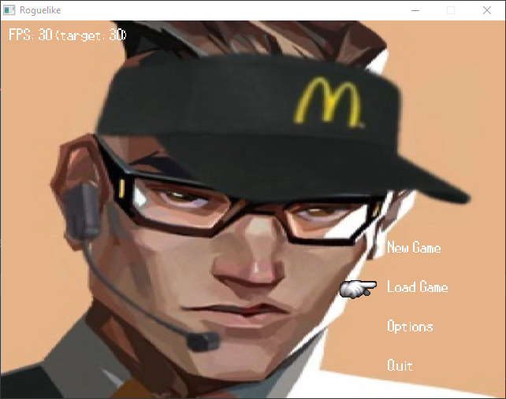

# 🎮 Roguelike - Aventure en 2D

Un jeu roguelike en 2D développé en C avec SDL2. Plongez dans des donjons générés procéduralement, affrontez des monstres et collectez des trésors !
A chaque nouvel essai, vous devenez plus puissants et progressez plus loin !

## 📸 Aperçu



## ✨ Fonctionnalités

- 🗺️ **Génération procédurale** - Des donjons uniques à chaque partie
- ⚔️ **Combat en temps réel** - Stratégie et réflexion
- 📦 **Inventaire** - Collectez et utilisez des objets
- 🎨 **Graphismes rétro** - Style pixel art
- 🔊 **Effets sonores** - Ambiance immersive
- 📊 **Système de progression** - Montez de niveau et apprenez de nouvelles compétences

## 🛠️ Technologies

- **Langage** : C
- **Bibliothèques** : SDL2
- **Compilateur** : GCC
- **Build** : Make

## 📋 Prérequis

### MingW64 (MSYS2)
```bash
pacman -S mingw-w64-x86_64-SDL2 mingw-w64-x86_64-SDL2_ttf mingw-w64-x86_64-SDL2_image
```

### Linux
```bash
sudo apt-get install libsdl2-dev libsdl2-ttf-dev libsdl2-image-dev
```

### macOS
```bash
brew install sdl2 sdl2_ttf sld2_image
```

## 🚀 Installation

### Cloner le projet
```bash
git clone https://github.com/brandonafonso31/Roquelike-2D.git
cd roguelike
```
### Compiler et lancer le jeu
```bash
make clean run
# or
make test
```

## 📝 Roadmap

✅ Structure de base  
✅ Gestion des FPS  
✅ Chargement des configurations  
✅ Main Menu  
🔄 Menu in Game (avant de rentrer dans les donjons)     
⬜ MC, Armes, Ennemis, Loot    
⬜ Système de combat  
⬜ Effets graphiques  
⬜ Effets sonores  
⬜ Génération de donjons  
⬜ Inventaire  
⬜ Sauvegarde  